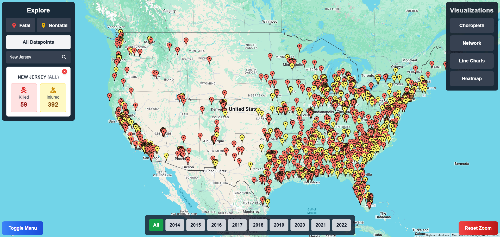
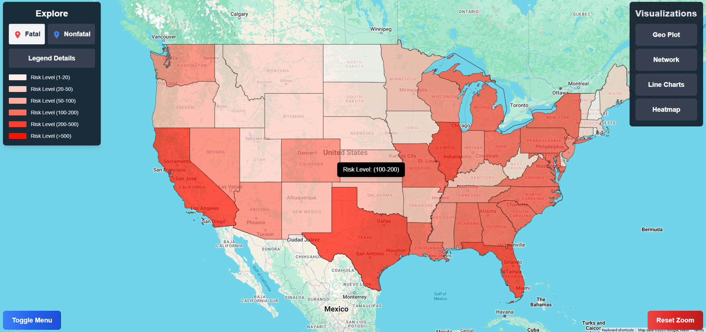
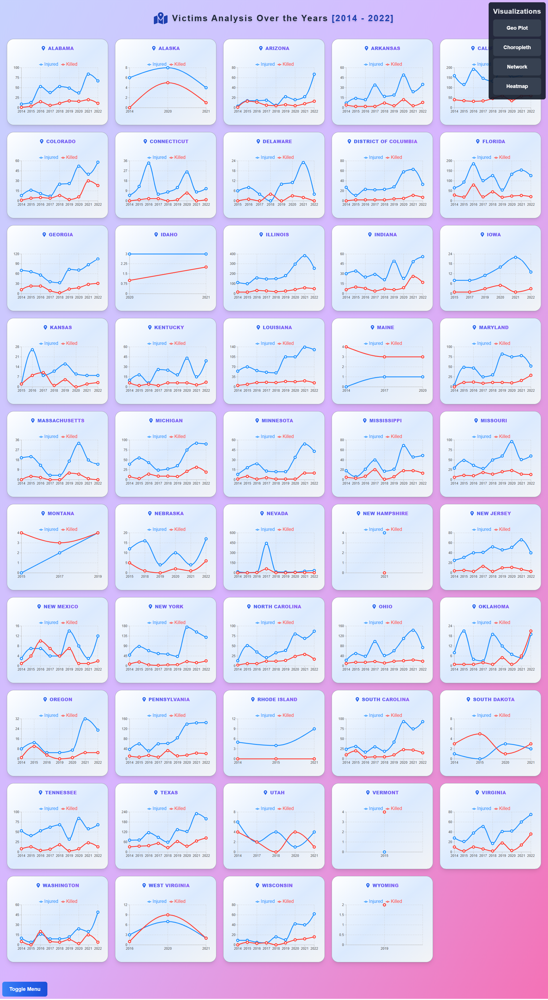
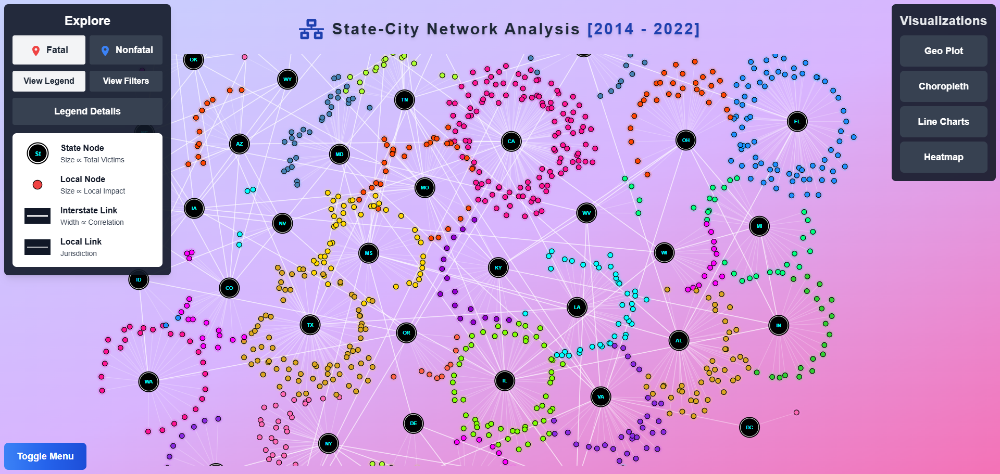
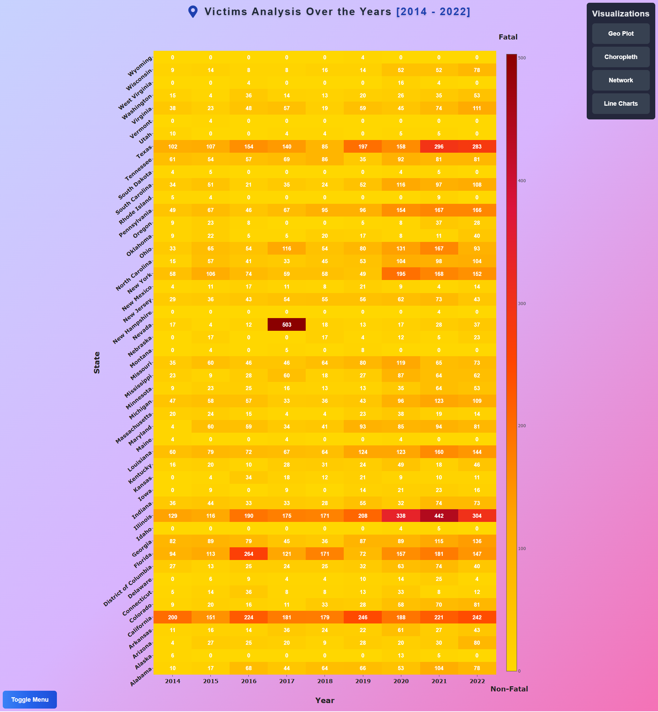

# 🗺️ Mass-Shootings-USA-2014-2022 [[Live Preview](https://mass-shootings-usa-2014-2022.vercel.app/)]

A comprehensive geospatial visualization dashboard analyzing mass shooting incidents across the United States from 2014-2022, built with Next.js, D3.js, and various visualization libraries.

### Geo Plot



### Choropleth Map



### Line Charts



### Network Visualization



### Heatmap



<br>

## ✨ Features

### 🎯 Main Visualization Dashboard

- 🗺️ Interactive US map with incident markers
- 🔍 State-wise filtering and search
- ⏳ Temporal analysis with year slider (2014-2022)
- 🎯 Toggle between fatal and non-fatal incidents
- 🔄 Dynamic zoom and reset functionality

<br>

## 📊 Additional Visualizations

1. **Choropleth Maps**

   - Separate views for fatal and non-fatal cases
   - Color-coded intensity based on incident frequency
   - State-wise statistical breakdown

2. **Network Visualization**

   - Node-based representation of incidents
   - State-wise clustering
   - Size encoding based on casualty count

3. **Line Charts**

   - Temporal trends by state
   - Comparative analysis of fatal vs non-fatal cases
   - Interactive tooltips

4. **Heatmap**
   - State-wise temporal patterns
   - Color intensity mapping for incident frequency
   - Year-over-year trend analysis

<br>

## 🚀 Getting Started

### Prerequisites

- Node.js 18.x or higher
- npm or yarn package manager

### Installation

1. Clone the repository

```bash
git clone https://github.com/VinayShetyeOfficial/mass-shootings-2014-2022-dv-project-redesigned
```

2. Navigate to the project directory:

```bash
cd Project
```

3. Install dependencies:

```bash
npm install
```

4. Set up environment variables:
   Create a `.env` file with necessary API keys:

```env
NEXT_PUBLIC_GOOGLE_MAPS_API_KEY=your_api_key
```

5. Run the development server:

```bash
npm run dev
```

<br>

## Data Processing

### Geocoding Process

The project includes Python scripts for:

1. Address geocoding using Google Maps API
2. Data cleaning and coordinate normalization
3. CSV processing and formatting

<br>

Key features of the geocoding process:

- Caching mechanism to avoid duplicate API calls
- Retry logic for failed requests
- Coordinate validation and cleaning

<br>

### Data Structure

The processed dataset includes:

- Incident ID
- Date and Location
- Casualty counts (killed/injured)
- Geocoded coordinates
- State and city information

<br>

## 📁 Project Structure

```
Project
├── public
│  └── data
│     ├── counties.json
│     ├── mass_shootings_2014_2022.csv
│     ├── states.js
│     ├── mass_shootings_geocoded.csv
│     ├── counties_choropleth.json
│     ├── mass_shootings_geocoded_cleaned.csv
│     └── states-10m.json
├── src
│  └── app
│     ├── components
|     |  ├── Loader.js
│     │  ├── MapComponent.js
│     │  ├── ExploreMenu.js
│     │  ├── ResetZoomButton.js
│     │  ├── VisualizationMenu.js
│     │  ├── ToggleButton.js
│     │  ├── StateSummary.js
│     │  └── YearSelector.js
│     ├── visualizations
│     │  ├── heatmap
│     │  │  └── page.js
│     │  ├── line-charts
│     │  │  └── page.js
│     │  ├── network
│     │  │  └── page.js
│     │  └── choropleth
│     │     ├── page.js
│     │     └── Legend.js
│     ├── context
│     │  └── MapContext.js
│     ├── utils
│     │  ├── processData.js
│     │  └── geocode.js
│     ├── layout.js
│     ├── globals.css
│     └── page.js
├── .env
├── .gitignore
├── eslint.config.mjs
├── jsconfig.json
├── next.config.mjs
├── package.json
├── package-lock.json
├── postcss.config.js
└── tailwind.config.js
```

<br>

## 🛠️ Development Opportunities

Future enhancements planned:

- Enhanced state-level drill-down capabilities
- Additional statistical analysis features
- Improved mobile responsiveness
- Real-time data updates
- Advanced filtering options

<br>

## 🤝 Contributing

Contributions are welcome! Please feel free to submit a Pull Request.

1. Fork the project
2. Create your feature branch (`git checkout -b feature/AmazingFeature`)
3. Commit your changes (`git commit -m 'Add some AmazingFeature'`)
4. Push to the branch (`git push origin feature/AmazingFeature`)
5. Open a Pull Request

<br>

## Acknowledgments

- Data source: Gun Violence Archive
- Inspired by various D3.js visualization projects
- Built upon previous HTML/CSS/JS implementation

---

For suggestions or support, feel free to [open an issue](https://github.com/YourUsername/Mass-Shootings-USA-2014-2022/issues)!

> [!NOTE]  
> This visualization tool is intended for educational and analytical purposes only.

<br>

## 📝 License

This project is licensed under the [MIT License](./LICENSE) - see the [LICENSE](./LICENSE) file for details.

<br>

## 📧 Contact

Vinay Shetye - [GitHub](https://github.com/VinayShetyeOfficial) - vinay.shetye.personal@outlook.com <br>
Project Link: [https://github.com/VinayShetyeOfficial/mass-shootings-2014-2022-dv-project-redesigned](https://github.com/VinayShetyeOfficial/mass-shootings-2014-2022-dv-project-redesigned)
